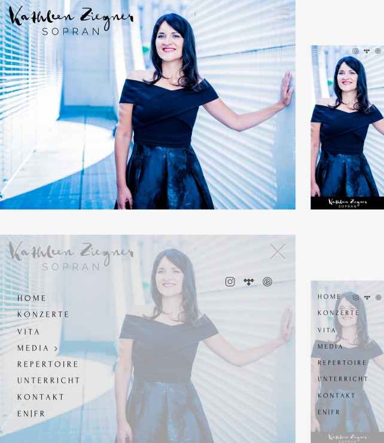
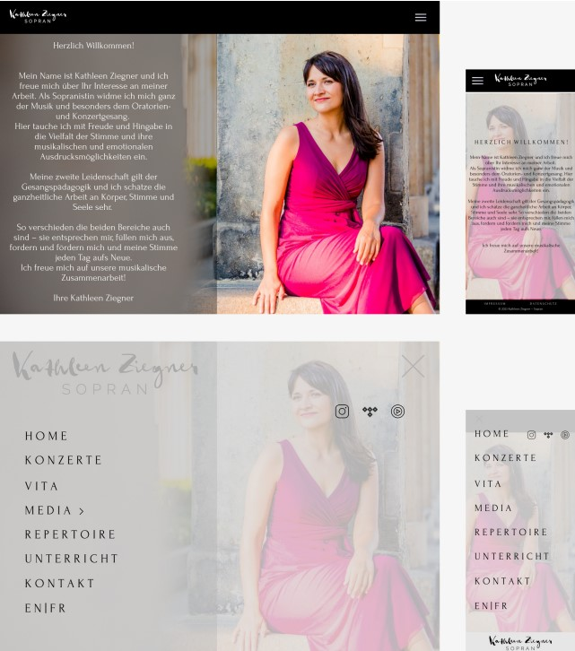
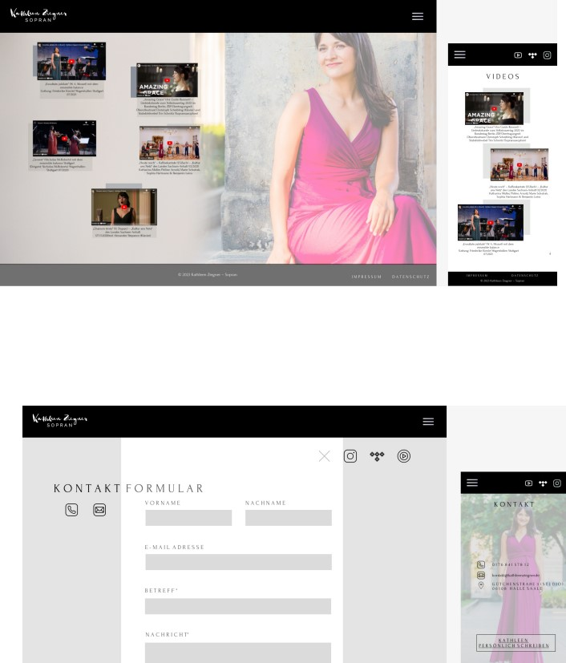

# Ziel

Das Ziel dieser Website ist es, die Persönlichkeit und Professionalität der Sopranistin Kathleen Ziegner zu präsentieren. Die Website soll ein ansprechendes und intuitives Design bieten, das die verschiedenen Aspekte ihrer Karriere als Sängerin und Gesangspädagogin hervorhebt.

## Farbpalette

Primärfarbe: Ein elegantes, tiefes Schwarz (#000000), das Professionalität und Seriosität ausstrahlt.
Sekundärfarbe: Ein weiches Weiß (#FFFFFF), das für Klarheit und Lesbarkeit sorgt.
Akzentfarbe: Ein kräftiges Fuchsia (#FF00FF), das Dynamik und Kreativität vermittelt und gleichzeitig feminine Eleganz unterstreicht.

## Typografie

Primärschriftart: Eine elegante Serifenschrift wie „Georgia“ oder „Times New Roman“ für Überschriften und Zitate, um einen klassischen und professionellen Eindruck zu vermitteln.
Sekundärschriftart: Eine klare und moderne Sans-Serif-Schrift wie „Arial“ oder „Helvetica“ für Fließtext und Menüs, um die Lesbarkeit zu gewährleisten.
Layout und Struktur
Die Website besteht aus mehreren Hauptabschnitten, die die verschiedenen Aspekte der Karriere von Kathleen Ziegner abdecken. Jeder Abschnitt wird durch große, hochwertige Bilder und eine klare, intuitive Navigation unterstützt.

1. Startseite
   Header: Ein großes, beeindruckendes Bild von Kathleen Ziegner mit ihrem Namen und dem Titel „Sopranistin“.
   Navigation: Ein einfaches, horizontal angeordnetes Menü mit den Hauptabschnitten der Website (Home, Konzerte, Vita, Media, Repertoire, Unterricht, Kontakt, Impressum).
   Willkommensnachricht: Eine kurze, herzliche Begrüßung mit einem Bild von Kathleen in einer ansprechenden Pose.
2. Über mich (Vita)
   Einführungstext: Ein detaillierter Text über Kathleens musikalischen Hintergrund, ihre Ausbildung und ihre beruflichen Highlights.
   Bildergalerie: Hochwertige Bilder aus verschiedenen Phasen ihrer Karriere.
3. Konzerte
   Konzertliste: Eine Liste der kommenden und vergangenen Konzerte mit Datum, Ort und einer kurzen Beschreibung.
   Konzertbilder: Bilder von Auftritten, die einen Eindruck von der Bühnenpräsenz und den Emotionen während der Auftritte vermitteln.
4. Media
   Video- und Audiogalerie: Eingebettete Videos und Audioclips von Auftritten, Interviews und Proben.
   Fotogalerie: Professionelle Fotos von Konzerten, Proben und Studioaufnahmen.
5. Repertoire
   Repertoireliste: Eine detaillierte Liste der Stücke, die Kathleen in ihrem Repertoire hat, geordnet nach Genre und Epoche.
   Beschreibung: Kurze Beschreibungen der Stücke und ihrer Bedeutung für Kathleen.
6. Unterricht
   Lehrphilosophie: Ein Text, der Kathleens Ansatz zum Gesangsunterricht und ihre pädagogischen Prinzipien beschreibt.
   Kursangebote: Eine Liste der angebotenen Kurse mit Details zu Inhalten, Terminen und Preisen.
   Anmeldeformular: Ein einfaches Formular zur Kontaktaufnahme und Anmeldung für Kurse.
7. Kontakt
   Kontaktinformationen: Adresse, Telefonnummer und E-Mail-Adresse.
   Kontaktformular: Ein Formular zur direkten Kontaktaufnahme.
   Social Media Links: Links zu Kathleens Social Media Profilen.
8. Impressum und Datenschutz
   Rechtliche Informationen: Alle erforderlichen rechtlichen Informationen, Datenschutzrichtlinien und Haftungsausschlüsse.
   Design-Elemente
   Hintergrundbilder: Großflächige, hochauflösende Bilder, die jeweils den aktuellen Abschnitt thematisch unterstützen.
   Buttons und Links: Klar gestaltete Buttons mit dezenter Farbgebung und deutlicher Beschriftung.
   Icons: Dezente, aber aussagekräftige Icons für Social Media, Kontakt und andere interaktive Elemente.
   Animationen: Sanfte Übergänge und Hover-Effekte, um die Benutzererfahrung zu verbessern und Interaktivität zu fördern.
   Responsives Design
   Die Website wird vollständig responsiv gestaltet, um auf allen Geräten (Desktop, Tablet, Smartphone) optimal dargestellt zu werden. Dies umfasst:

Flexible Grid-Layouts: Verwendung von flexiblen Grids, die sich an verschiedene Bildschirmgrößen anpassen.
Responsive Bilder: Skalierbare Bilder, die sich an die jeweilige Bildschirmgröße anpassen.
Mobile Navigation: Eine vereinfachte, leicht zugängliche Navigation für mobile Geräte.

### Projektübersicht

Projektname: Sopranistin-Website für Kathleen Ziegner
Ziel: Erstellung einer modernen, responsiven und SEO-optimierten Website für die Sopranistin Kathleen Ziegner, die auf der Next.js-Framework basiert und ein eigenes Backend zur Verwaltung von Bild-Uploads bietet.

Projektphasen und Meilensteine
Phase 1: Planung und Anforderungsanalyse
Dauer: 1 Woche
Meilensteine:

Anforderungsanalyse:
Sammeln und Dokumentieren der Anforderungen von Kathleen Ziegner.
Definieren der Zielgruppen und ihrer Bedürfnisse.
Projektplan:
Erstellung eines detaillierten Projektplans mit Zeitrahmen, Ressourcen und Meilensteinen.
Technologie-Stack:
Auswahl der Technologien: Next.js für das Frontend, Node.js und Express für das Backend, MongoDB für die Datenbank.
Phase 2: Design
Dauer: 2 Wochen
Meilensteine:

Wireframes und Mockups:
Erstellung von Wireframes und Mockups für alle Seiten der Website basierend auf dem Designkonzept.
Abstimmung und Freigabe der Designs durch Kathleen Ziegner.
User Experience (UX):
Planung der Nutzerführung und Interaktionsdesigns.
Phase 3: Entwicklung des Frontends
Dauer: 4 Wochen
Meilensteine:

Next.js Setup:
Einrichtung der Next.js-Applikation mit TypeScript-Unterstützung.
Layout-Komponenten:
Erstellung der Hauptlayout-Komponenten (Header, Footer, Navigation).
Seitenentwicklung:
Entwicklung der einzelnen Seiten: Startseite, Vita, Konzerte, Media, Repertoire, Unterricht, Kontakt, Impressum.
SEO-Optimierung:
Integration von SEO-optimierten Meta-Tags, Open Graph-Tags und Schema.org-Markup.
Responsives Design:
Sicherstellen, dass das Design auf allen Geräten optimal dargestellt wird.
Phase 4: Entwicklung des Backends
Dauer: 3 Wochen
Meilensteine:

Backend-Setup:
Einrichtung der Node.js- und Express-Umgebung.
Datenbankdesign:
Erstellung des Datenbankschemas in MongoDB.
API-Entwicklung:
Entwicklung der RESTful API-Endpunkte zur Verwaltung von Inhalten und Bild-Uploads.
Sicherheit:
Implementierung von Authentifizierung und Autorisierung (z.B. JWT).
Bild-Upload-Funktionalität:
Integration von Multer oder einer ähnlichen Bibliothek für den Bild-Upload.
Phase 5: Integration und Test
Dauer: 2 Wochen
Meilensteine:

Integration:
Verbindung von Frontend und Backend.
Sicherstellen der reibungslosen Kommunikation zwischen den beiden Komponenten.
Testing:
Durchführung von Unit-Tests, Integrationstests und End-to-End-Tests.
Benutzerakzeptanztests (UAT) mit Kathleen Ziegner zur Sicherstellung, dass alle Anforderungen erfüllt sind.
Phase 6: Bereitstellung und Wartung
Dauer: 1 Woche
Meilensteine:

Deployment:
Bereitstellung der Anwendung auf einem Produktionsserver (z.B. Vercel für das Frontend, Heroku oder DigitalOcean für das Backend).
Monitoring:
Einrichtung von Monitoring-Tools zur Überwachung der Anwendung im Live-Betrieb.
Wartung:
Geplante Wartungsarbeiten und regelmäßige Updates zur Sicherstellung der Funktionalität und Sicherheit.
Aufgaben und Verantwortlichkeiten
Projektmanager: Koordination des gesamten Projekts, Sicherstellung der termingerechten Lieferung.
Frontend-Entwickler: Entwicklung der Benutzeroberfläche mit Next.js und React.
Backend-Entwickler: Entwicklung des Backends mit Node.js, Express und MongoDB.
Designer: Erstellung von Wireframes, Mockups und dem finalen Design.
SEO-Spezialist: Sicherstellung der SEO-Optimierung der Website.
QA-Tester: Durchführung von Tests zur Sicherstellung der Qualität der Anwendung.
